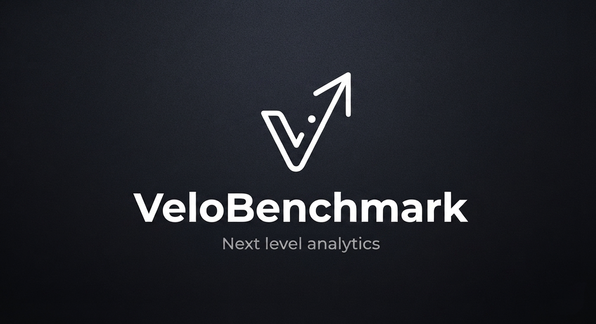
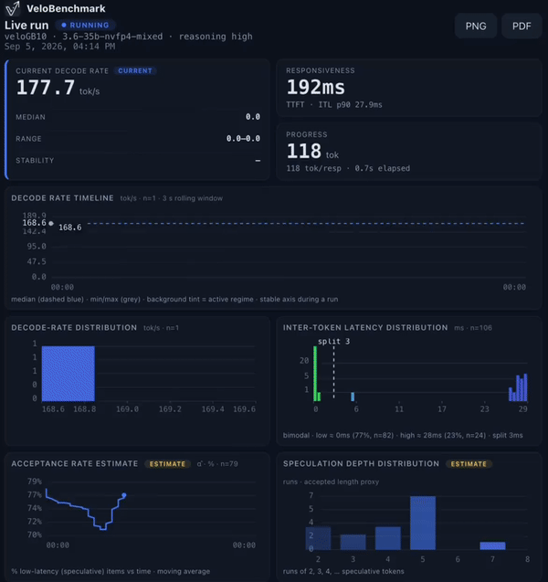
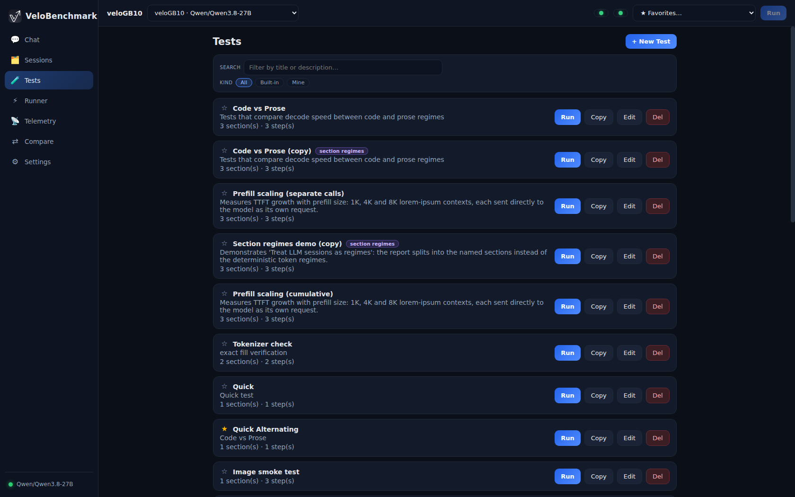
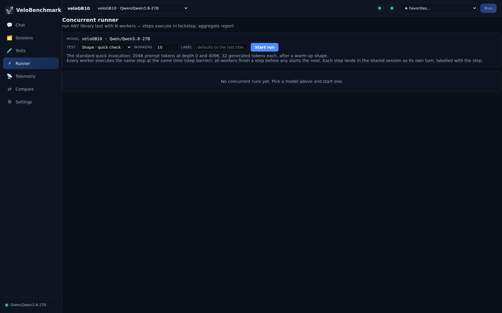
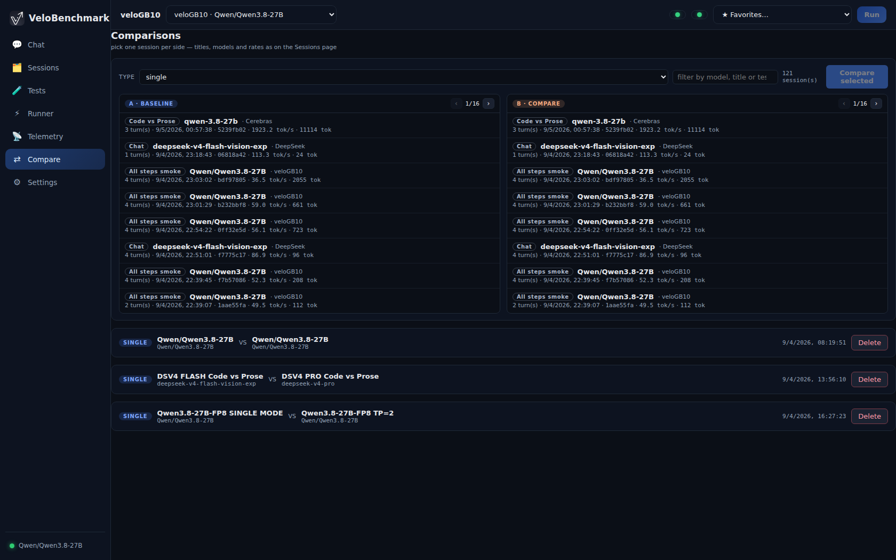
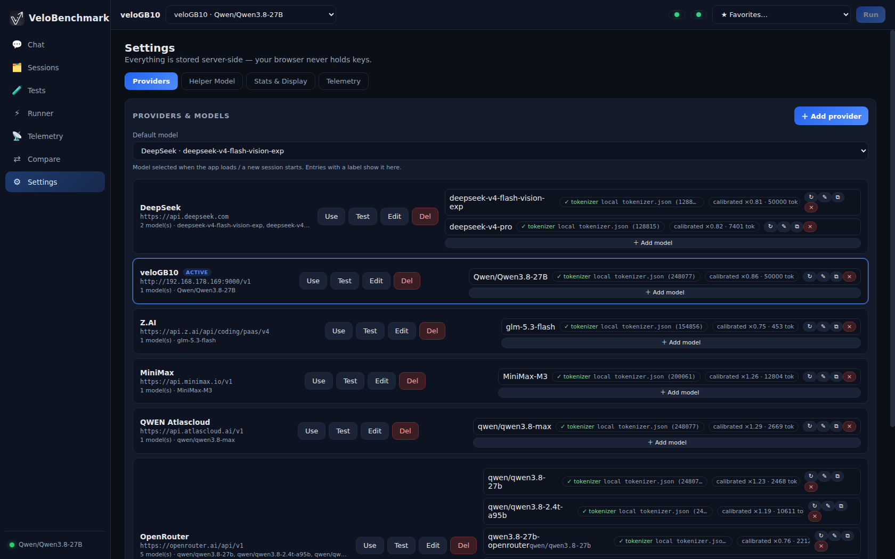

<p align="center">
  
</p>

# VeloBenchmark

**A single-binary LLM benchmarking and live-stats console, used entirely from your browser.**

<p align="center">
  
</p>

> **Visit our web page for more information: [velobenchmark.com](https://velobenchmark.com)**

VeloBenchmark (`velobench`) is a from-scratch Rust server that packs a full web UI into one binary.
Point it at any OpenAI-compatible endpoint and you get the whole loop in a browser: chat with a model
and watch accurate decode-speed and latency instruments in real time → build test suites (prose, code,
math, vision, fixed-shape context tests) → run them single-stream or under concurrent load → read the
report, compare sessions, export PNG/PDF. It can even sit as a live telemetry dashboard in front of a
serving engine's OpenTelemetry stream.

The deliverable is **one binary**: the Angular frontend is compiled in and served by the Rust backend
(`include_dir!`). Deploying is copying one file. At runtime it only creates the data files it needs —
nothing else is required on the host. No terminal interaction after launch; everything runs in the
browser.

## What it does

- **Measures what actually happens, per token.** Decode rates are computed from real streaming token
  timing; when the provider reports `usage`, the final numbers snap to the authoritative token counts.
  Live min / median / max, TTFT, inter-token latency, prefill behaviour — all server-side, all
  exportable.
- **Shows output-type effects.** Every answer is tagged by regime (prose, code, math, json,
  reasoning, …) as it streams; the charts split by regime so you can see a model slow down on math and
  speed up on code within one answer.
- **Turns scenarios into repeatable suites.** A visual test builder with five step types — sections,
  prompts, exact context fills, fixed-shape bench requests, and vision steps over an embedded image
  library.
- **Scales the same suite to concurrency.** N workers walk a test with a step barrier, one shared
  report, per-worker timelines and their sum.
- **Comparisons.** Line up any sessions — same prompts across models, before/after a server change,
  single vs concurrent — in one view.

## Features

**Chat & manual testing**
- Full SSE streaming with Stop; reasoning deltas captured separately.
- Image attachments on messages (OpenAI `image_url` parts) for vision models.
- Context-fill prefill tests from the composer (measure TTFT at any depth).
- Live stats panel: rolling tok/s, TTFT, progress, per-regime decode graph, histograms; one-click
  **PNG/PDF export** of the stats screen.
- Single-prompt or aggregated (multi-prompt) stats modes.

**Tests**
- Built-in suites: sanity & arithmetic, prefill scaling, section regimes, fixed-shape sweeps, regime
  switching (JS ⇄ story, math ⇄ story), pure-code, deep-reasoning, creative-prose, and a vision sweep
  across all embedded images.
- UI **and** JSON editors; per-test temperature / max-token settings; per-step generation budgets;
  exact-tg mode.
- Validation on both ends; built-ins refresh on boot while your tests and favourites persist.

**Runner (concurrent load)**
- N parallel workers on one test with a step barrier — phase-aligned reports.
- Live per-worker snapshots (state, tok/s, TTFT, tokens) and a workers + Σ decode timeline in the
  report.
- All turns land in one session; failures surface immediately.

**Reports & comparisons**
- Per-session analytics: at-a-glance, token composition, throughput, latency, quality & diagnostics
  (decode-rate/ITL histograms, acceptance-rate estimate, speculation-depth distribution, TTFT per
  request).
- Persistent side-by-side comparisons of any sessions.
- PNG/PDF export everywhere it matters.

**Telemetry (built-in OTLP receiver)**
- Accepts OTLP/HTTP-JSON (`/v1/logs`, `/v1/metrics`) from a serving engine and turns it into live
  per-stream panels — text feed + full instrument set, ~10 updates/s, computed server-side.
- Record a rolling window into a permanent session with one click.
- Off by default; enabled in Settings. See [Telemetry setup](docs/telemetry.md).

**Server-side settings**
- Multiple OpenAI-compatible providers (base URL + key), live non-cached model discovery, per-model
  parameter overrides, reasoning effort, helper model for meta-analysis — stored in `velobench_data/`,
  never in the browser.

## Screenshots

| | |
|---|---|
|  |  |
| **Tests** — built-in suites + visual builder | **Runner** — concurrent execution |
|  |  |
| **Comparisons** — sessions side by side | **Settings** — providers, models, telemetry |

## Installation

Installation is one line (Linux & macOS, x86_64 + arm64):

```bash
curl -fsSL https://raw.githubusercontent.com/sf-stav/VeloBench/main/install.sh | sh
```

The installer downloads a prebuilt binary from GitHub Releases when one exists for your platform, and
otherwise builds from source into `~/.velobenchmark` (installing Rust, Node and `protoc` into your
home directory — no root required). It starts the server, health-checks it, and prints the URL to
open — e.g. `http://localhost:13843`. Stop it later with `kill $(cat
~/.velobenchmark/velobench.pid)`. Full instructions are in **[INSTALL.md](INSTALL.md)**.

Example output (macOS, arm64 — the installer detects your platform either way):

```
(base) user@host % curl -fsSL https://raw.githubusercontent.com/sf-stav/VeloBench/main/install.sh | sh
    platform: macos/arm64

VeloBenchmark installer — single-binary LLM benchmarking console

==> trying prebuilt binary for macos/arm64
    prebuilt binary ready: /Users/doth/.velobenchmark/velobench

==> starting VeloBenchmark on port 13843

  ┌──────────────────────────────────────────────────────┐
  │                                                      │
  │   VeloBenchmark is running                           │
  │                                                      │
  │   ➜  open:  http://localhost:13843                   │
  │            http://192.168.178.98:13843               │
  │                                                      │
  └──────────────────────────────────────────────────────┘
    data directory: /Users/doth/.velobenchmark/velobench_data
    logs:           /Users/doth/.velobenchmark/velobench.log
    stop:           kill $(cat /Users/doth/.velobenchmark/velobench.pid)
    re-start:       /Users/doth/.velobenchmark/velobench --host 0.0.0.0 --port 13843   (run it from /Users/doth/.velobenchmark)
```

<details>
<summary>Build it yourself instead</summary>

```bash
# build (Rust + Node + protoc; see docs/building.md)
npm --prefix frontend install
bash scripts/build-frontend.sh
cargo build --release

# run
./target/release/velobench --host 0.0.0.0 --port 13843
# open http://localhost:13843
```

</details>

Then: Settings → add a provider + model → chat → run a built-in test → read the report. The
[user manual](docs/user-manual.md) walks every page.

## Documentation

**💻 [velobenchmark.com](https://velobenchmark.com)** — our website: news, screenshots, and more
information about VeloBenchmark. VeloBenchmark is a **self-hosted** tool — you install it (one-liner
above, or build from source) and run it yourself; it is not offered as a hosted service.

| Document | Contents |
|---|---|
| [User manual](docs/user-manual.md) | Every page, every report, building tests, the runner, quick start |
| [Installation](INSTALL.md) | One-line installer + build-from-source, prereqs, first run, browser access |
| [Building & installing](docs/building.md) | Prerequisites, build, run, service setup |
| [Telemetry setup](docs/telemetry.md) | Receiver settings + the engine's `--otel-*` flags, tuning and recipes |
| [Known limitations](docs/limitations.md) | The honest edges |
| [ROADMAP](docs/ROADMAP.md) | What's next |

## Command-line

| Flag | Default | Meaning |
|---|---|---|
| `--host` | `0.0.0.0` | Bind address |
| `--port` | `13843` | Bind port |
| `--data-dir` | `velobench_data` | Where settings, sessions and tests are persisted |

## Design notes

- **One binary.** The UI is compiled into the server (`include_dir!`) — deploy is copying one file;
  new embedded assets (e.g. vision images) need a rebuild.
- **Measurements are computed server-side** from the stream, not the browser — the UI is a window onto
  the same numbers the reports store.
- **API keys live server-side** in `velobench_data/settings.json` — never in the browser. The tool is
  meant for a trusted network; there is no auth.
- **Telemetry can't hurt generation.** The receiver is passive; emitters drop rather than block when
  anything is slow.

## License

AGPL-3.0. See [LICENSE](LICENSE).

## Thanks

Thanks to the people behind **[llama-benchy](https://github.com/eugr/llama-benchy)** for the inspiration
and some of the ideas that shaped VeloBenchmark.

