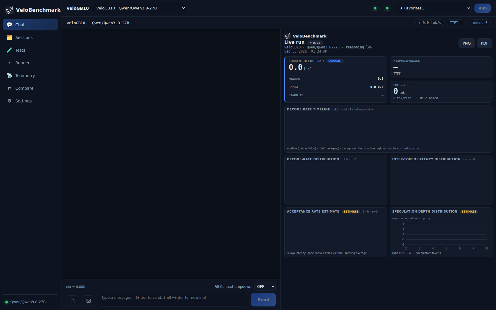
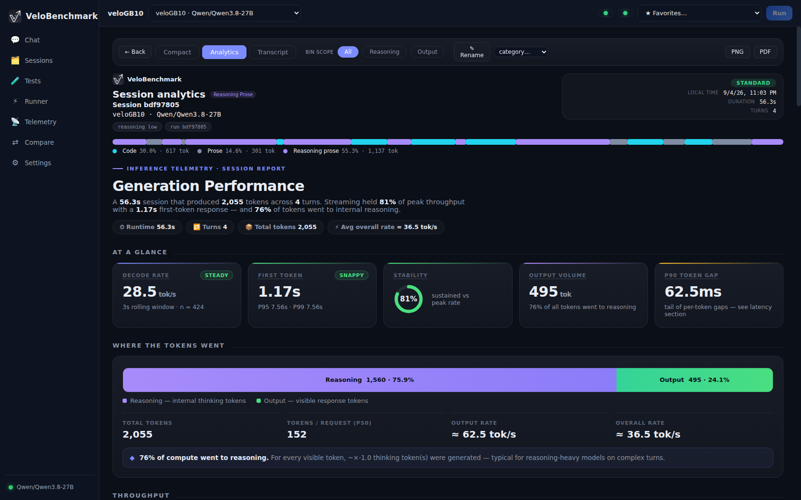
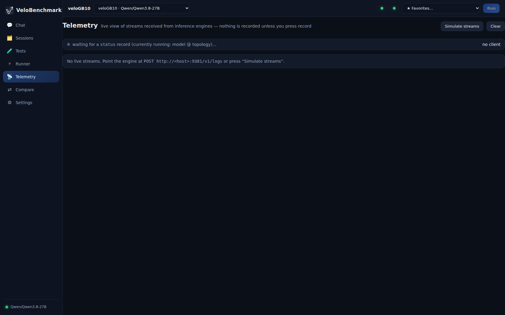

# VeloBenchmarkmark — User Manual

VeloBenchmarkmark is a single-binary LLM **live-stats benchmarking and chat console**.
This manual walks through every screen, how to create and run tests, and how to
read the reports.

> New here? Start with the [Quick start](#quick-start) at the bottom, then come
> back for the details.

Table of contents:

- [Adding providers and models](#adding-providers-and-models)
- [Chat — manual testing](#chat--manual-testing)
- [The live stats panel](#the-live-stats-panel)
- [Tests — building suites](#tests--building-suites)
- [Runner — concurrent load](#runner--concurrent-load)
- [Sessions](#sessions)
- [Session analytics — what each report shows](#session-analytics--what-each-report-shows)
- [Comparing sessions](#comparing-sessions)
- [Telemetry](#telemetry)
- [Quick start](#quick-start)

---

## Adding providers and models

Everything lives in **Settings** (⚙ in the sidebar). Settings are stored
server-side in `velobench_data/` — they survive browser changes and restarts.

1. **Add a provider** — an OpenAI-compatible base URL plus an API key. Any
   server that speaks `/v1/chat/completions` works (llama.cpp `llama-server`,
   vLLM, LM Studio, OpenRouter, cloud endpoints, …).
2. **Add a model** — the model list is fetched **live from the provider's
   `/v1/models` every time the dialog opens** (never cached), so new models
   appear immediately.
3. **Per-model configuration**:
   - **Parameter overrides** — `temperature`, `top_k`, `repetition_penalty`,
     `seed`, … as key/value pairs. These are merged into every request the
     model serves.
   - **Reasoning** — a per-model reasoning toggle and effort level (off /
     low / medium / high / …). When reasoning is off, no effort is sent.
   - **Tokenizer** — optional path/URL to a `tokenizer.json` for exact token
     counting. Without it, VeloBenchmarkmark probes the server's tokenizer;
     as a last resort it falls back to an estimated count (you can set a
     per-model **live calibration ratio** to bring live tok/s in line with the
     provider's authoritative usage numbers).
4. **Helper model** — a separate provider/URL/key/model used for background
   meta-analysis (e.g. output classification). Independent of your chat models.
5. **Model + provider switcher** — the dropdown in the top bar switches the
   active config for the current session; the persisted default can be set in
   Settings.

## Chat — manual testing

The Chat page (💬) is a full streaming chat console with a live measurement
instruments attached.

- **Send** any prompt; the answer streams in with server-side live stats.
- **Stop** mid-generation — the partial turn still records its stats.
- **Attach images** — click the attachment control (or paste) to add images to
  a message; they are sent as OpenAI `image_url` parts. Vision-capable models
  describe them; the turn is measured like any other.
- **Fill Context** — a selector next to the composer sends a lorem-ipsum
  prefill of a chosen size (K tokens = 1024 tokens) to measure TTFT /
  prefill speed at various context depths. The box is disabled while the fill
  streams and returns to OFF afterwards.
- **Reasoning models** — reasoning deltas are captured separately and shown
  (and measured) distinctly from answer content.
- **New Chat** starts a fresh VeloBenchmarkmark session; each session keeps its
  own identity and report.

### The live stats panel

While a turn streams (and once it finishes), the right-hand panel shows:

- **Current decode rate** — tok/s over a rolling window, plus the tokens
  generated so far.
- **Responsiveness** — time-to-first-token and elapsed generation time.
- **Progress** — output vs reasoning token split, averages, and the final
  snap to the provider's authoritative `usage` counts when reported.
- **Decode-rate timeline** — per token-group decode speed, tinted by the
  detected output regime (prose / code / math / json / reasoning / …).
- **Split graphs per regime** — when a model switches output type mid-answer
  (code → prose → math), each regime gets its own coloured segment, which
  exposes the minimum and maximum decode speeds.
- **Histograms and prefill bars** — distribution views for quality/regime
  analysis and prefill measurements.
- **Export** — the visible stats screen exports as **PNG** or **PDF**.

## Tests — building suites

The Tests page (🧪) lists built-in suites and your own tests.

- **Built-in suites** cover: sanity & arithmetic, prefill scaling, section
  regimes, fixed-shape sweeps (pp/tg sweeps and a quick shape check), regime
  switching (JS⇄story, math⇄story), pure code, deep reasoning, creative
  prose, and a vision sweep across all embedded test images. Built-ins are
  view/run only and refresh on every server start — your favourite marks on
  them survive.
- **Your tests** are created with **New test** and edited in either:
  - **UI mode** — add steps with the buttons; reorder with ↑/↓; the first
    step is always a Section (it names the first sub-test).
  - **JSON mode** — edit the definition directly.

### Step types

| Step | Purpose |
|------|---------|
| **Section** | Names a sub-test in progress/reports. With **Reset context** it clears the conversation (a fresh sub-test); without it, it is just a marker. When "Treat LLM sessions as regimes" is on, section titles become the regime names in reports. |
| **Prompt** | Sends text to the model, as-is. Optional per-step generation budget (`tg`) and a **per-step reasoning override** — *inherit* (model config), *off*, or a forced effort level (low/medium/high/xhigh). |
| **Context** | Fills the context with an exact lorem-ipsum payload (chosen in K tokens) before the next prompt — cumulative context tests stay exact. |
| **Bench** | A fixed-shape run: ONE request with `depth` corpus tokens + `pp` measured prompt tokens, generating `tg` tokens. `exact-tg` forces the full generation (no early stop). Independent of history. |
| **Image** | A vision request: pick one of the embedded test images (dropdown lists them **by size**) and write the prompt (default: *"Please describe this image."*). The image is sent to the model; the turn streams and records like any other. If the model rejects the image (no vision support, provider error), **the test stops and shows the error**. |

Test-level settings: **temperature** and **max output tokens** — applied to
every step unless a step overrides them. Several built-ins demonstrate both.

- **Run** — executes the test as a single-stream conversation, live on the
  Chat screen (this is the "manual" mode: realistic timing, one request at a
  time, full history replay between steps).
- The ⚡ **Runner** executes the same tests under concurrent load — see next
  section.

> Adding your own images to the vision dropdown: drop files into
> `assets/test_images/` and rebuild — images are embedded in the binary at
> compile time (see [Building](building.md)).

## Runner — concurrent load

The Runner (⚡) executes a test with **N workers in parallel**, all walking
the same plan with a **step barrier**: every worker finishes step *k* before
any worker starts step *k+1*, so the report stays phase-aligned.

1. Pick the **provider + model** and the **test** (defaults to the quick
   shape check).
2. Set the **worker count** and start. Each step shows:
   - the current step title and progress bar,
   - one snapshot per worker — state (queued / starting / streaming / done /
     failed), tok/s, TTFT, completion tokens,
   - per-step failures, with the reason.
3. **Stop** aborts the run; completed turns are kept.
4. All turns land in **one VeloBenchmark session**, so the normal reports apply —
   the analytics view adds a **Decode Rate Timeline — Workers + Σ** section
   showing each worker's decode rate and their sum (your effective
   concurrency throughput).
5. Vision steps under load: if a provider errors on an image, the whole test
   stops immediately and the reason shows in the banner — no half-finished
   ambiguity about which shapes ran.

## Sessions

The Sessions page (🗂) lists every recorded VeloBenchmarkmark session — chat
conversations, test runs, concurrent runs — with their turn counts and model
labels. Open one to jump into its analytics; sessions can be renamed, favourited
and deleted here.

## Session analytics — what each report shows

The analytics view is the full report for one session.

- **At a Glance** — the headline numbers: total tokens, wall time, average and
  peak decode rate, TTFT summary, per-regime split of the output.
- **Where the Tokens Went** — reasoning vs output vs fill composition, and the
  regime breakdown of generated content.
- **Throughput** — decode-rate story for the session: average, min / median /
  max with the reference lines, per-regime rates for single-stream sessions
  (or the single-stream average for concurrent ones).
- **Latency** — TTFT per request, decode-time distribution, inter-token
  latency (ITL) distribution.
- **Quality & Diagnostics** — decode-rate distribution histogram, ITL
  histogram, acceptance-rate estimate and speculation-depth distribution
  (for speculative-decoding servers), first-token latency by request.
- **Decode Rate Timeline — Workers + Σ** (concurrent sessions only) — every
  worker's decode rate over time plus their sum: how well the server keeps up
  as workers stream in parallel.
- **Export** — the whole report exports to PNG / PDF for sharing.

## Comparing sessions

The Compare page (⇄) puts sessions side by side.

1. Select two or more sessions from the list (chat runs, test runs,
   concurrent runs — any mix).
2. **Compare selected** creates a persistent comparison.
3. The comparison view lays the sessions' headline numbers and timelines next
   to each other — same prompts across models, before/after server tuning,
   single vs concurrent, vision vs text: whatever you line up.

## Telemetry

VeloBenchmarkmark ships a built-in **OTLP/HTTP-JSON telemetry receiver** that turns
a serving engine's OpenTelemetry stream into a live dashboard.

- Enable it in **Settings → Telemetry** (host + port; `9381` is the default).
- Point your engine at it — e.g. `--otel-endpoint http://<velobench-host>:9381`.
- The Telemetry page then shows one live panel per stream: the streaming text
  feed, the same stats deck as the chat page, and the full chart set.
- **Record** captures the rolling window into a normal session (with
  recording caps for seconds and tokens), so a stream you caught mid-flight
  becomes a permanent report.
- Full setup — engine flags, batch tuning, recipes — has its own page:
  [Telemetry setup](telemetry.md).

## Quick start

1. **Build** (or grab a release binary): see [Building & installing](building.md).
2. **Start**: `./target/release/velobench --host 0.0.0.0 --port 13843` and open
   `http://localhost:13843`.
3. **Settings → add a provider** (base URL + key), add a model, pick it in the
   top bar.
4. **Chat** — send a prompt and watch the live stats.
5. **Tests → Run** a built-in suite (try *Regime switch · JavaScript ⇄ story*
   to see decode speed swing between code and prose, or *Vision · all test
   images* on a vision model).
6. **Sessions → open the run → export** the report as PNG/PDF.
7. **Runner** — same test, N workers, one shared report.
8. **Compare** — line two sessions up and see what changed.
